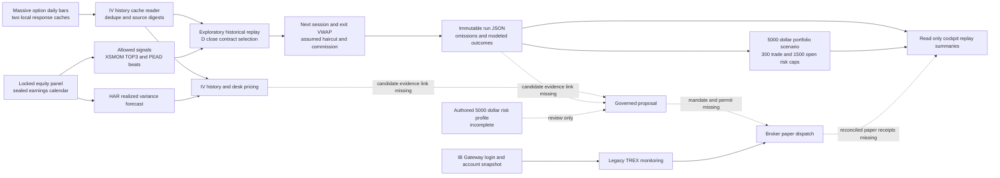

# TREX historical strategy system graph

Broker deployment status: **BLOCKED** pending a trusted mandate, outbox,
broker reconciliation, and a flat legacy book.

Source branch: `feat/governed-action-foundation` at `b3023f7`. This graph
describes installed source paths and the missing authority links. It does not
certify deployment or a profitable strategy.

## Current evidence

| Lane | Source | Current claim |
| --- | --- | --- |
| Direction | `desk.signals` | XSMOM TOP3 and PEAD beats are the two allowed direction signals. Other desk factors are context or research-disabled. |
| Volatility | `desk.har`, `FORECAST-001-results.md` | Pooled HAR beat RV22 on the sealed realized-variance forecast test at 20 and 63 sessions. This does not establish trade profitability. |
| Implied volatility | `IVHIST-001-results.md` | IWM is the only pair labeled `ok`; broader IV quality is not established. |
| Exploratory trade replay | `historical_replay.py`, `scripts/run_desk_historical_replay.py` | Daily option VWAP scenarios with next-session prices, omissions, source digests and a per-trade cap. No broker fills, quote spread measurement, concurrent exposure, or daily stop. |
| Portfolio scenario | `portfolio_replay.py`, `scripts/run_desk_portfolio_scenario.py` | Variant-by-variant modeled concurrent reservation under $5,000 capital and $300/$1,500 caps. Daily loss stop and intraday exits remain untested. |
| Sealed option study | `DESK-BT-001.md` and amendment | Separately preregistered; needs 20 recorded chain sessions and a measured haircut before its scored run. It does not consume or inherit an exploratory replay verdict. |
| Capital review | `action_graph.capital` | Candidate screening only. Daily loss cap, horizon, win floor, reward tiers and allowed strategy versions still need an authored profile. |
| Paper broker | `trex.gateway_watch`, `trex.ibkr`, `trex.enter`, `trex.monitor` | Existing login, account observation and legacy order ownership. No governed action-model dispatch is installed. |
| Cockpit | `GET /api/desk/historical-replays`, `GET /api/desk/portfolio-scenarios`, `GET /api/action-model/example` | Read-only replay and portfolio summaries and a synthetic plan. None authorizes trading. |

## First local replay

`replay-20260927T065530Z-87344cc363e3.json` covered six names, decisions
from 2025-01-01 through 2025-06-30, 30–90 entry DTE, both direction signals,
three structures, 1% assumed per-leg haircut and a $300 modeled trade-loss
cap. It attempted 21 signal/structure rows: 18 exceeded the cap, one lacked
an entry leg and one lacked an entry or exit bar. One AVGO XSMOM put-credit
row remained (+$41.19 modeled P&L, $148.45 modeled max loss). Six further
signal/structure rows lacked decision-day spot or option bars before an
attempt could be made. These are sequential, mutually exclusive exclusion
branches in `historical_replay.replay`, so the six pre-attempt rows are not
part of the 21 attempts. One favorable modeled row is not a win-rate estimate.

## Independent model review

On 2026-09-27, bounded read-only calls to local `MiniMax-M3` and
`glm-5.3-flash` reviewed the frozen first replay. Their exact prompt and
source hashes and raw proposal receipts are recorded in
`/home/alexk/documents/tree_options/artifacts/desk-store/evaluations/model-review/20260927/manifest.json`.
Both identified the tiny
evaluable sample, untested $1,500 combined open-risk limit, assumed fills,
and lack of a $5,000 portfolio path. Flash also proposed per-attempt
exclusion records. Both models described the exclusion counters as
overlapping; source inspection of the sequential `continue` branches shows
that description is false for this run. Model proposals are research input,
not authority to change trading controls or evidence of an edge.

## Missing links before a governed paper trade

1. Bind every proposal to an immutable source/data/result ID, with review of
   the candidate's payoff and strategy version.
2. Complete and authenticate the $5,000 capital profile and mandate, with
   expiry and revocation. The paper account's $1 million equity is not the
   strategy budget.
3. Reserve risk and persist an intent and single-use permit before broker
   submission. Recheck paper account, owner epoch, margin and market facts
   at the send boundary.
4. Reconcile unknown submissions, partial fills, corrections and assignment
   before retries or added exposure, then prove a supervised IBKR paper cycle.
5. Evaluate any selected strategy on frozen out-of-sample dates, realistic
   fills and the concurrent $1,500 open-loss cap. Do not tune to the single
   favorable exploratory row.
